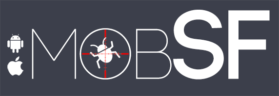
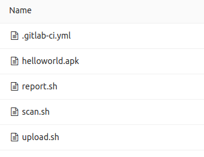

# Mobile Security Framework



### Introdução

Opa galera, beleza ? :v:  

O objetivo desse post é apresentar a ferramenta do MobSF, mostrar como funciona, instalação e como usar, o mesmo será apresentado como subir uma imagem em docker, utilizar REST API, e uma POC em Gitlab CI.

### O que é?

O MobSF é uma ferramenta que analisa a APK verificando a vulnerabilidade do mesmo.  
Com ele podemos fazer tanto a análise estática, quanto a análise dinâmica. A análise estática é capaz de realizar revisão de código,  detectar permissão, configurações, sendo possivel verificar ssl overriding, ssl bypass, criptografia fraca, códigos ofuscados, permissões impróprias, segredos codificados, uso indevido de API, e armazenamento inseguro de arquivos.  
O analisador dinâmico executa o aplicativo em uma máquina virtual ou em um dispositivo configurado e detecta os problemas em tempo de execução. Uma análise mais aprofundada é feita nos pacotes de rede capturados, tráfego HTTPS desencrito, despejos de aplicativos, registros, relatórios de erros ou falhas, informações de depuração, rastreamento de pilha e os recursos do aplicativo, como definir arquivos, preferências e bancos de dados.  
Esta estrutura é altamente escalável e você pode adicionar suas regras personalizadas com facilidade. Um relatório rápido e limpo pode ser gerado no final dos testes.
A ferramenta pode ser utilizada tanto para Android e IOS, suportando o binário (APK e IPA), e códigos fontes compactados.
A ferramenta pode ser utilizada via API, e será mostrado aqui nesse documento.

### Primeiros passos  

Para funcionar e rodar MobSF com sucesso, os próximos passos terão que ser seguidos e as ferramentas que deverão estar instaladas:

Faça o download do Oracle JDK 1.7 (ou superior) - Java JDK Download  
Faça o git clone do repositório do MobSF, o mesmo estará alguns scripts que precisarão ser executados. Logo após entre no repositório (como mostra abaixo).

```
git clone https://github.com/MobSF/Mobile‐Security‐Framework‐MobSF.git
cd Mobile‐Security‐Framework‐MobSF
```
Faça a instalação do Python, pois os scripts são em Python, e rode o comando em seguida para que as dependencias possam ser instaladas, siga os passos abaixo:

```
sudo apt install build‐essential libssl‐dev libffi‐dev python‐dev
pip install ‐r requirements.txt ‐‐user
```

O comando a seguir permite que você rode o MobSF:

```
python manage.py runserver
```

Ao executar esse comando o mesmo irá gerar um Token (esse token sempre será o mesmo na máquina onde ele estiver), o token será utilizado para que possamos fazer a análise via API, portanto, é importante deixa-lo guardado.

### MobSF com Docker
Faça a instalação do Docker  
**[Documetação](https://docs.docker.com/)**  
**[Instalação](https://docs.docker.com/engine/installation/linux/ubuntu/)**

Para subir a imagem da ferramenta, basta seguir os passos abaixo:
Faça o clone do repositório, caso não tenha-o feito ainda:

```
git clone https://github.com/MobSF/Mobile-Security-Framework-MobSF.git
```

Assim que o repositório for clonado, entre na pasta do mesmo, e execute os comandos a seguir:
```
docker build -t mobsf .
docker run -it -p 8000:8000 mobsf
```
ou
```
docker pull opensecurity/mobile-security-framework-mobsf
docker run -it -p 8000:8000 opensecurity/mobile-security-framework-mobsf:latest
```

### REST API
Abaixo será mostrado como podemos fazer a analise, e gerar o report via API, para isso basta seguir os passo abaixo:
O comando a seguir faz o upload para o MobSF, onde poderá ser visto no browser.

```
curl -F 'file=@/<path>/<apk>.apk' http://localhost:8000/api/v1/upload -H "Authorization: <Token>"
```

O "<Token>", é o mesmo que é gerado quando rodamos o MobSF.
Quando o comando for executado será gerado um hash (esse hash será diferente para cada apk/ipa) onde também terá que ser guardado, para que possamos utilizar para fazer o scan e report.
Para fazer o scan do apk, basta executar o comando a seguir:

```
curl -X POST --url http://localhost:8000/api/v1/scan --data "scan_type=apk&file_name=<apk>.apk&hash=<hash>" -H "Authorization: <Token>"

```

E por fim e não menos importante, gerar o report:
```
curl -X POST --url http://localhost:8000/api/v1/delete_scan --data "hash=<hash>" -H "Authorization:<Token>" -o <name_report>.pdf

```

### POC do MobSF com GitlabCI
Foi criado três jobs, cada job foi feito um script para acessar a API.
Primeiros passos é configurar as variaveis que serão utilizadas, nesse caso, o Token, e a url do MobSF, segue abaixo os passos para a criação das variaveis:
Projects >> Settings >> Pipelines >> Add new variable

Iniciando o YAML:

```
# Job da pipeline
# Arquivo: .gitlab-ci.yml
stages:
  - upload
  - scan
  - report
```

##### Jobs  
###### Upload  
Abaixo as configurações do job para que seja feito o upload do arquivo para o MobSF:
```
# Arquivo .gitlab-ci.yml
upload:
  stage: upload
  script:
   - find *.apk > apk # Encontra a APK e coloca o nome do mesmo em um arquivo "apk".
   - export APK=$(cat apk) # Como precisamos utilizar o mesmo em uma variavel, fazemos um export para isso.
   - bash upload.sh $URL_MOBSF $TOKEN_MOBSF # Rodamos o script para fazer o upload, o mesmo esta logo abaixo. Junto com as variáveis que configuramos.
  artifacts:
   paths:
    - hash
    - apk
```
Script para fazer o upload da APK para o MobSF via API:
```
#!/bin/bash
# Upload a new APK to MobSF
# Arquivo upload.sh

URL=$1
Token=$2
curl -F "file=@/builds/lucas.mucheroni/MobSF/$APK" "$URL"/api/v1/upload -H "Authorization: $Token" | jq --raw-output .hash > hash

# Com o jq é possivel fazer um "filtro" e trazer apenas a hash do curl, e é colocado dentro de um arquivo "hash"

```


###### Scan  
Job para fazer o scan do APK, segue abaixo como é feito:
```
# Arquivo .gitlab-ci.yml

scan:
  stage: scan
  script:
   - export hash=$(cat hash) # Export para passar o valor do hash para uma variavel.
   - export APK=$(cat apk) # Como é feito no job anterior o mesmo é feito com o job de scan
   - bash scan.sh $URL_MOBSF $TOKEN_MOBSF # Um script para fazer o scan via API, segue abaixo o script. Junto com as variáveis configuradas.
  artifacts:
   paths:
    - hash
    - apk
```
O script abaixo faz o scan do APK que foi feito upload no job anterior, segue abaixo o script:
```
#!/bin/bash
# Scan APK
# Arquivo scan.sh

URL=$1
Token=$2

curl -X POST --url $URL/api/v1/scan --data "scan_type=apk&file_name=$APK&hash=$hash" -H "Authorization:$Token"
```

###### Report
Por último e não menos importante, gerar o report do através do scan que foi feito no job anterior, segue abaixo o job:
```
# Arquivo .gitlab-ci.yml

report:
  stage: report
  script:
   - export hash=$(cat hash) # Faz o export novamente para utilizar como variavel.
   - export APK=$(cat apk) # O mesmo aqui.
   - bash report.sh $URL_MOBSF $TOKEN_MOBSF # Executa um script para gerar o report, o mesmo segue abaixo. Junto com as variáveis configuradas.
   - bash slack.sh 'Link para download:' 'https://example.com/'$CI_PROJECT_NAMESPACE'/'$CI_PROJECT_NAME'/builds/artifacts/master/download?job=report' # Executa um script para enviar uma notificação no slack, com o link para fazer o download do report.
  artifacts:
    name: "report"
    paths:
    - /builds/lucas.mucheroni/MobSF/*.pdf # Arquiva o report e fica disponivel para download até uma semana.
    expire_in: 1 week
```
Abaixo o script para gerar o report do scan feito, o mesmo também é feito via API, segue abaixo:
```
#!/bin/bash
# Report
# Arquivo report.sh

URL=$1
Token=$2

curl -X POST --url $URL/api/v1/download_pdf --data "hash=$hash&scan_type=apk" -H "Authorization:$Token" -o /builds/lucas.mucheroni/MobSF/$APK.pdf

```

Finalizando os scripts e o yaml o seu repositório terá que ficar como mostra o print abaixo:



Lembrando que a apk se localiza no repositório do próprio MobSF (Mobile-Security-Framework-MobSF/StaticAnalyzer/test_files).

Segue abaixo toda a documentação completa do MobSF:  
**[Documentação](https://github.com/MobSF/Mobile-Security-Framework-MobSF/wiki/1.-Documentation#configuring-dynamic-analyzer-with-with-mobsf-android-412-arm-emulator)**  
**[REST API](https://github.com/MobSF/Mobile-Security-Framework-MobSF/wiki/3.-REST-API-Documentation)**  
**[Docker](https://github.com/MobSF/Mobile-Security-Framework-MobSF/wiki/7.-Docker-Container-for-MobSF-Static-Analysis)**  
**[Repositório MobSF](https://github.com/MobSF/Mobile-Security-Framework-MobSF)**  

Bom, é isso galera, dúvidas e sugestões são muito bem-vindas, use os campos abaixo para isso. :smile:

Até a próxima! :wave:
